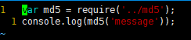
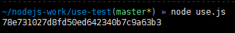

## MD5代码阅读
### 一、仓库展示
 名称: MD5  
 功能：用于显示MD5信息的JavaScript程序。  
 地址：[nodejs-MD5](http://xuejiawei1.github.io/nodejs-MD5)  
 #### 仓库包含文件及作用  
 > README.md :程序介绍的markdown文档  
 > md5.js ：MD5程序实现的主代码  
 > test.js : 代码测试脚本  
 > package.json : 项目依赖项  
 > LICENSE : MIT 共享协议  
 > .gitignore : 排除不必要的项目文件  
 > .travis.yml : 持续集成的配置文件  
   
 > demo ： index.html ：可以显示文件的MD5信息    
           use.js : 使用MD5方法获取“message”的MD5信息   
           use-buf.js : 用buffer方法获取“example.txt”的MD5信息     
 > dist : md5.min.js : md5的前端js文件  
 > docs : question MD5代码阅读的markdown文档  
### 二、代码解读  
>主要是对md5.js文件进行解读  
#### 1. 依赖模块  
crypt : 用于加密和进行散列的工具  
charenc : 提供加密字符编码的程序  
is-buffer : 判断一个对象是否为buffer的工具  
#### 2. 算法  
if...else 语句 进行判断，函数分支
for 循环语句 进行加密算法的操作  
###### 数据结构  
字符串：类型判断，值判断，截取赋值等  
对象：作为函数返回值，作为对象的属性，类型判断等  
###### 具体步骤  
1. 程序先将传入的数据转化为数组
2. 初始化变量  
3. 交换字节顺序，将低位字节排放在内存的低地址端，高位字节排放在内存的高地址端。  
4. 进行MD5的加密算法  
5. 返回128位的十六进制信息
##### 设计模式种类 
代码模块 | 是否为暴露模块|描述
---|---|---
var,require | |全局变量定义和引入第三方模块
exports | |暴露模块
md5(message,option)|是|对message进行加密，返回MD5信息
md5._ff，md5._gg，md5._hh，md5._ii |否| 对数据的二进制进行处理  

### 三、MD5程序的使用  
1. 通过md5(value)使用  
  
  
2. 通过buffer方法使用  
  
  
### 四、mocha自动化测试  
> 执行npm test   
  

### 五、Travis ci持续集成  
  
  
### 六、其他问题  
1. 代码中暂未发现bug或可改进的地方  
2. 代码中最难理解的时MD5算法的加密过程，目前对二进制位操作还有一些不理解的地方
3. 项目的入口文件即为md5.js  
4. 代码的编码风格很好，便于阅读，函数的划分也较为合理  
5. 通过阅读理解此代码，掌握了一些关于二进制位操作符的知识，例如：  
  + '~'  非 按位取反  
+ '&'  与 同1为1，其他为0  
+ '|'  位或 有1为1  
+ '^'  异或 两个操作数的位中，相同则结果为0，不同则结果为1  
+ '<<num'   左移num位  
+ '>>>num'  右移num位  
### 七、MD5消息摘要算法  
> 对MD5算法简要的叙述可以为：MD5以512位分组来处理输入的信息，且512位细分成16个小组，每个小组32位，经过了一系列的处理后，算法的输出由四个32位分组组成，将这四个32位分组级联后将生成一个128位散列值。
###### 1.填充：   
   * 在信息的后面填充一个1和无数个0，直到满足上面的条件时才停止用0对信息的填充。  
   * 在这个结果后面附加一个以64位二进制表示的填充前信息长度（单位为Bit），如果二进制表示的填充前信息长度超过64位，则取低64位。  
经过这两步的处理，信息的位长=N*512+448+64=(N+1）*512，即长度恰好是512的整数倍。这样做的原因是为满足后面处理中对信息长度的要求。  
***
  ###### 2.初始化变量：
  初始的128位值为初始链接变量，这些参数用于第一轮的运算，以大端字节序来表示,  
      （每一个变量给出的数值是高字节存于内存低地址，低字节存于内存高地址，即大端字节序。  
      在程序中变量A、B、C、D的值分别为1732584193，-271733879，-1732584194，271733878)  
***
######  3.处理分组数据,每一分组的算法流程:  
   * 第一分组需要将上面四个链接变量复制到另外四个变量中：a到aa，b到bb，c到cc，d到dd。从第二分组开始的变量为上一分组的运算结果，即aa = a， bb = b， cc = c， dd = d。  
   * 主循环有四轮，每轮循环都很相似。第一轮进行16次操作。每次操作对a、b、c、d中的其中三个作一次非线性函数运算，然后将所得结果加上第四个变量，文本的一个子分组和一个常数。再将所得结果向左环移一个不定的数，并加上a、b、c或d中之一。最后用该结果取代a、b、c或d中之一。  
   * 以下是每次操作中用到的四个非线性函数（每轮一个）。  
      F( X ,Y ,Z ) = ( X & Y ) | ( (~X) & Z )  
      G( X ,Y ,Z ) = ( X & Z ) | ( Y & (~Z) )  
      H( X ,Y ,Z ) =X ^ Y ^ Z  
      I( X ,Y ,Z ) =Y ^ ( X | (~Z) )  
     （&是与（And），|是或（Or），~是非（Not），^是异或（Xor）)  
      这四个函数的说明：如果X、Y和Z的对应位是独立和均匀的，那么结果的每一位也应是独立和均匀的。  
      F是一个逐位运算的函数。即，如果X，那么Y，否则Z。函数H是逐位奇偶操作符.  
   * 现定义：
      FF(a ,b ,c ,d ,x ,s ,t ) 操作为 a = b + ( (a + F(b,c,d) + x + t) << s)  
      GG(a ,b ,c ,d ,X ,s ,t ) 操作为 a = b + ( (a + G(b,c,d) + X + t) << s)  
      HH(a ,b ,c ,d ,X ,s ,t) 操作为 a = b + ( (a + H(b,c,d) + X + t) << s)  
      II(a ,b ,c ,d ,X ,s ,t) 操作为 a = b + ( (a + I(b,c,d) + X + t) << s)  
      注意：“<<”表示循环左移位，不是左移位。  
      所有这些完成之后，将a、b、c、d分别在原来基础上再加上aa、bb、cc、dd  
